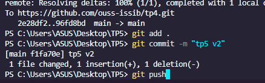
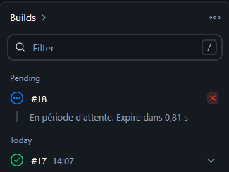
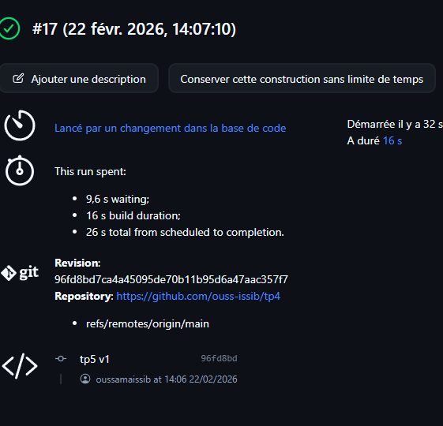
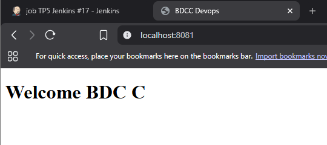
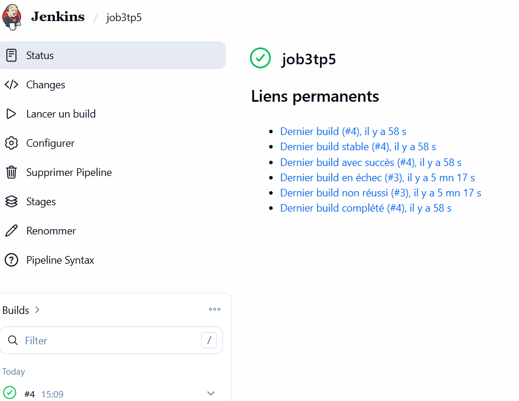
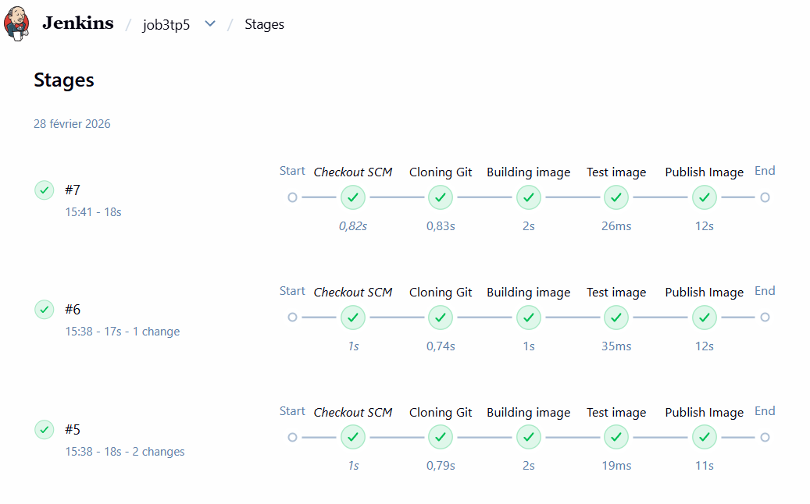
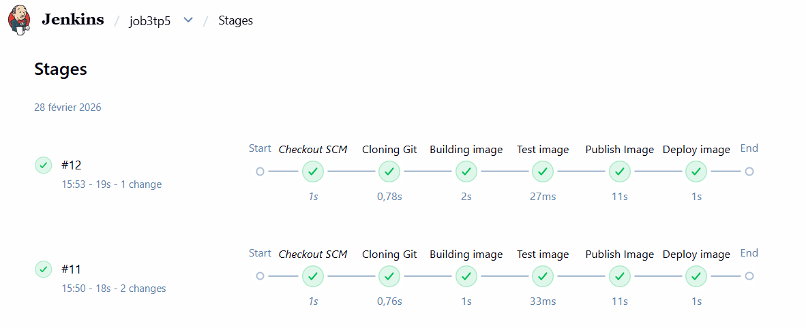
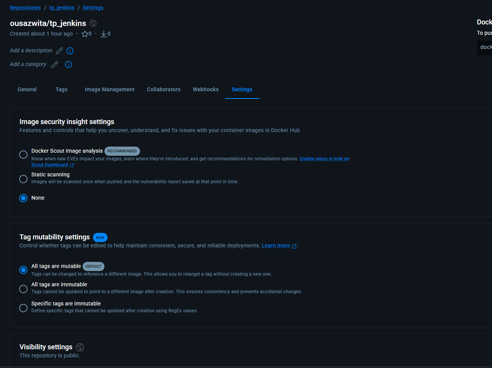
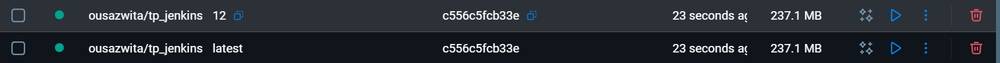
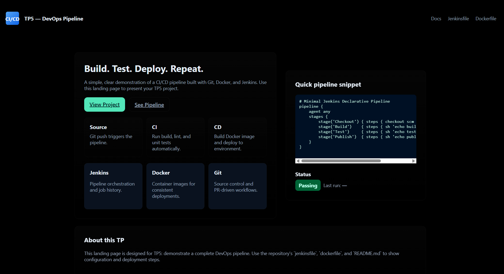

# TP 5 : Docker Engine, Jenkins et CI/CD

Ce projet documente la mise en place d'une chaîne d'intégration continue (CI) automatisée pour une application web conteneurisée.

## 1. Objectifs de la Partie 1
* Configuration de l'environnement Jenkins sur Windows.
* Automatisation du build d'une image Docker Nginx.
* Publication automatique vers le registre Docker Hub.

## 2. Configuration Technique
### Pipeline Jenkins (Job Freestyle)
Le job **job TP5 Jenkins** est lié au dépôt GitHub et configuré pour se déclencher à chaque commit.
* **Source** : `https://github.com/ouss-issib/tp4`.
* **Credentials** : Utilisation d'un Token d'accès sécurisé pour le compte Docker Hub `ousazwita`.

### Docker Hub
Le dépôt distant est configuré en mode **Public** pour permettre le déploiement ultérieur.
* **Repository** : `ousazwita/tp_jenkins`.

## 3. Workflow de l'Application
1. **Modification du Code** : Changement effectué dans le fichier `index.html` (ex: "tp5 v2").
2. **Push Git** : Envoi des modifications vers la branche `main` via `git push`.
3. **Build Jenkins** : Déclenchement automatique du build (Build #17 réussi en 16s).
4. **Push Docker** : Publication de la nouvelle image sur Docker Hub.
5. **Résultat** : L'application est accessible localement sur le port `8081`.

## 4. Captures d'Écran
| Étape | État |
| :--- | :--- |
| **Push** |  |
| **Pending** |  |
| **Commit & Push** |  |
| **Succès Build** |  |
| **Application Live** |  |

---

## 5. Partie 2 : CI/CD (Pipeline as Code)
Cette phase bascule la configuration vers un modèle **Pipeline as Code** via un fichier `Jenkinsfile`.Cette approche permet d'automatiser l'intégralité du cycle de vie du logiciel et d'obtenir une visibilité claire via la **Stage View**.

### Configuration du Pipeline
Le projet est configuré en mode **Pipeline script from SCM**.Jenkins récupère automatiquement le script de build depuis GitHub pour orchestrer les étapes suivantes:
* **Cloning Git** : Récupération de la branche `main` (anciennement `master`).
* **Building image** : Construction de l'image Docker avec un tag unique `$BUILD_NUMBER` pour assurer l'immuabilité.
* **Test image** : Validation du build avec une étape de test (ex: "Tests passed").
* **Publish Image** : Publication de l'image sur Docker Hub avec les identifiants `dockerhub`.
* **Deploy image** : Déploiement automatisé du conteneur sur le port `8081` après nettoyage des anciennes instances.

### Automatisation via Webhooks
En utilisant un tunnel **ngrok** pour exposer Jenkins sur Internet, un Webhook GitHub est configuré pour déclencher le pipeline instantanément après chaque `git push`.

## 6. Captures d'Écran (Partie 2 - CD)
| Étape du Pipeline | Image de Référence |
| :--- | :--- |
| **Configuration Jenkinsfile** |  |
| **Déclenchement GitHub Hook** |  |
| **Visualisation Stage View** |  |
| **Image Docker Générée** |  |
| **Conteneur en cours d'exécution** |  |
| **Application Live (Latest)** |  |

---
*Réalisé par Oussama Issib - 2025/2026*.
